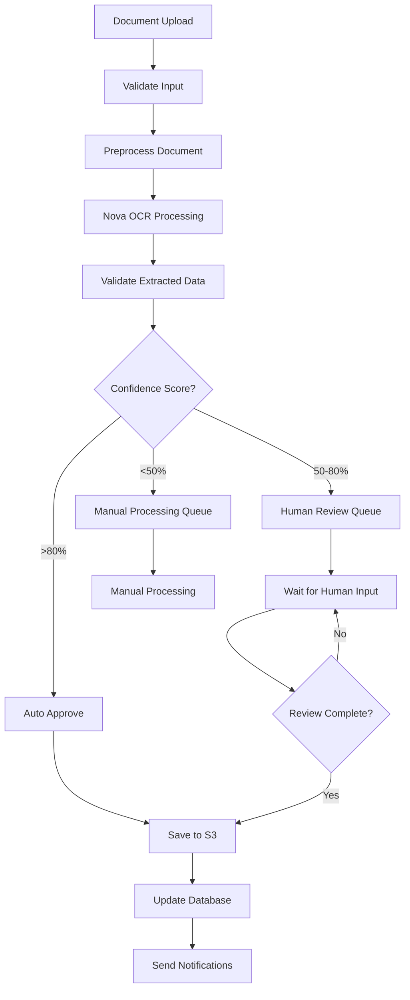

# Step Functions RPA Implementation for Medical OCR

This directory contains a complete AWS Step Functions implementation that mimics traditional RPA workflows for medical document processing.

## 🎯 **Why Step Functions for RPA?**

AWS Step Functions provides excellent RPA-like capabilities:

- **Visual Workflows**: Easy to understand and modify business processes
- **Error Handling**: Built-in retry logic and exception handling
- **Human-in-the-Loop**: Natural integration for manual review steps
- **Scalability**: Handles high-volume document processing
- **Monitoring**: Built-in logging and execution tracking
- **Cost-Effective**: Pay only for what you use
- **Integration**: Native AWS service integration

## 📁 **Files Overview**

### Core Workflow
- **`document_processing_workflow.json`** - Main Step Functions state machine definition
- **`deploy_step_function.py`** - Deployment script for AWS resources
- **`integrate_with_webapp.py`** - Integration with your Flask web application

### Lambda Functions
- **`lambda_functions/nova_processor.py`** - Amazon Nova OCR processing
- **`lambda_functions/data_validator.py`** - Medical data validation logic

## 🔄 **RPA Workflow Steps**

The Step Functions workflow mimics a complete RPA process:

1. **Document Validation** - Check file format and accessibility
2. **Preprocessing** - Image enhancement and optimization
3. **OCR Processing** - Amazon Nova text extraction
4. **Data Validation** - Medical field validation and confidence scoring
5. **Decision Logic** - Route based on confidence scores:
   - High confidence (>80%) → Auto-approve
   - Medium confidence (50-80%) → Human review queue
   - Low confidence (<50%) → Manual processing queue
6. **Human Review** - Wait for human input when needed
7. **Final Processing** - Save to S3 and update databases
8. **Notifications** - Send completion/error alerts

## 🚀 **Quick Deployment**

1. **Deploy Infrastructure:**
   ```bash
   cd step_functions
   python deploy_step_function.py
   ```

2. **Update Your Web App:**
   ```python
   # Add to your app.py
   from step_functions.integrate_with_webapp import StepFunctionRPAIntegration
   
   STATE_MACHINE_ARN = "your-step-function-arn"
   rpa_integration = StepFunctionRPAIntegration(STATE_MACHINE_ARN)
   ```

3. **Trigger Workflow:**
   ```python
   # Instead of direct Nova processing
   result = rpa_integration.trigger_rpa_workflow(
       s3_bucket="your-bucket",
       s3_key="path/to/document",
       document_type="medical",
       session_id="unique-id"
   )
   ```

## 🏗️ **Architecture Comparison**

### Traditional RPA vs Step Functions

| Feature | Traditional RPA | Step Functions RPA |
|---------|----------------|-------------------|
| **Scalability** | Limited by bot licenses | Unlimited, serverless |
| **Cost** | Fixed licensing costs | Pay-per-execution |
| **Maintenance** | Manual updates | Version-controlled |
| **Monitoring** | Third-party tools | Built-in CloudWatch |
| **Error Handling** | Custom scripting | Native retry/catch |
| **Integration** | API calls | Native AWS services |

## 📊 **Workflow Decision Logic**



## 🔧 **Configuration**

### Environment Variables
```bash
# Step Functions
STEP_FUNCTION_ARN=arn:aws:states:region:account:stateMachine:MedicalOCRProcessingWorkflow

# SQS Queues
HUMAN_REVIEW_QUEUE_URL=https://sqs.region.amazonaws.com/account/medical-ocr-human-review-queue
MANUAL_PROCESSING_QUEUE_URL=https://sqs.region.amazonaws.com/account/medical-ocr-manual-processing-queue

# SNS Topics
COMPLETION_TOPIC_ARN=arn:aws:sns:region:account:medical-ocr-completion
ERROR_TOPIC_ARN=arn:aws:sns:region:account:medical-ocr-errors
```

## 🎛️ **Human Review Integration**

The workflow includes sophisticated human-in-the-loop processing:

### Review Queue Management
- Documents with medium confidence scores are queued for human review
- SQS messages contain all necessary context for reviewers
- Web interface allows reviewers to edit and approve documents
- Workflow waits for human input with configurable timeouts

### Review Interface
```python
@app.route('/review/<session_id>')
def review_document(session_id):
    # Load document from queue
    # Display editable form
    # Allow approve/reject/edit actions
    # Continue Step Functions workflow
```

## 📈 **Monitoring and Analytics**

### Built-in Monitoring
- **CloudWatch Metrics**: Execution counts, duration, success rates
- **X-Ray Tracing**: End-to-end request tracing
- **CloudWatch Logs**: Detailed execution logs
- **Step Functions Console**: Visual execution tracking

### Custom Metrics
- OCR accuracy rates
- Processing times by document type
- Human review queue lengths
- Cost per document processed

## 🔒 **Security Features**

- **IAM Roles**: Least-privilege access for each component
- **Encryption**: Data encrypted in transit and at rest
- **VPC Integration**: Optional private network deployment
- **Audit Logging**: Complete audit trail of all processing

## 💰 **Cost Optimization**

### Step Functions Pricing
- **Standard Workflows**: $0.025 per 1,000 state transitions
- **Express Workflows**: $1.00 per 1 million requests
- **Lambda**: Pay only for compute time used
- **Storage**: S3 and DynamoDB pay-per-use

### Cost Comparison Example
For 10,000 documents/month:
- **Traditional RPA**: $500-2000/month (licensing + infrastructure)
- **Step Functions RPA**: $50-200/month (actual usage)

## 🚦 **Getting Started**

1. **Deploy the infrastructure:**
   ```bash
   python deploy_step_function.py
   ```

2. **Implement Lambda functions:**
   - Copy the provided templates
   - Add your specific business logic
   - Deploy using AWS CLI or CDK

3. **Integrate with web app:**
   - Replace direct Nova calls with Step Functions triggers
   - Add status checking endpoints
   - Implement review interfaces

4. **Test the workflow:**
   ```bash
   aws stepfunctions start-execution \
     --state-machine-arn your-arn \
     --input '{"s3_bucket":"test-bucket","s3_key":"test-doc.pdf","session_id":"test-123"}'
   ```

## 🔄 **Migration from Direct Processing**

To migrate your existing web app:

1. **Keep existing endpoints** for backward compatibility
2. **Add new RPA endpoints** that use Step Functions
3. **Gradually migrate** document types to the new workflow
4. **Monitor performance** and adjust as needed

## 📚 **Additional Resources**

- [AWS Step Functions Developer Guide](https://docs.aws.amazon.com/step-functions/)
- [Step Functions Best Practices](https://docs.aws.amazon.com/step-functions/latest/dg/bp-express.html)
- [Lambda Function Examples](https://github.com/aws-samples/aws-lambda-developer-guide)
- [Medical OCR Best Practices](https://docs.aws.amazon.com/bedrock/latest/userguide/model-parameters-nova.html)

## 🆘 **Troubleshooting**

### Common Issues
1. **IAM Permissions**: Ensure all services have proper permissions
2. **Timeout Settings**: Adjust Lambda and Step Functions timeouts
3. **Queue Visibility**: Check SQS message visibility timeouts
4. **Rate Limits**: Monitor Bedrock API rate limits

### Debug Commands
```bash
# Check execution status
aws stepfunctions describe-execution --execution-arn your-execution-arn

# Get execution history
aws stepfunctions get-execution-history --execution-arn your-execution-arn

# Check Lambda logs
aws logs tail /aws/lambda/medical-ocr-nova-processor --follow
```

This Step Functions implementation provides a robust, scalable, and cost-effective alternative to traditional RPA tools while maintaining all the workflow automation benefits you need for medical document processing.
